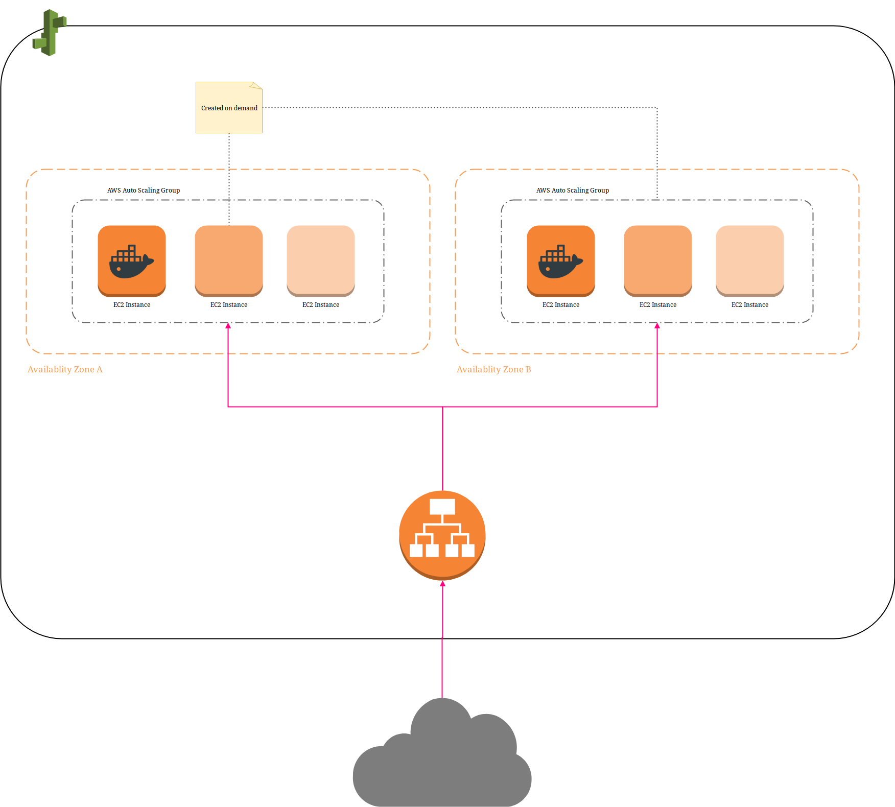
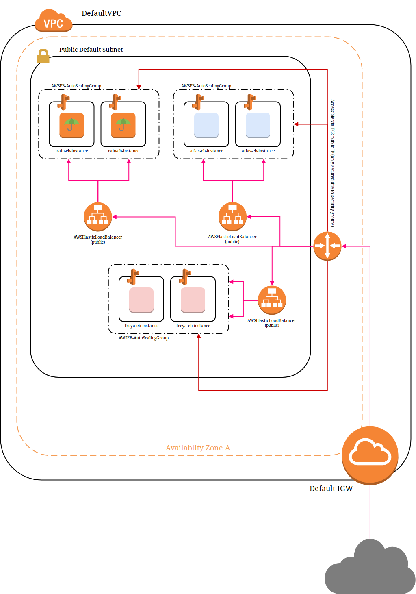
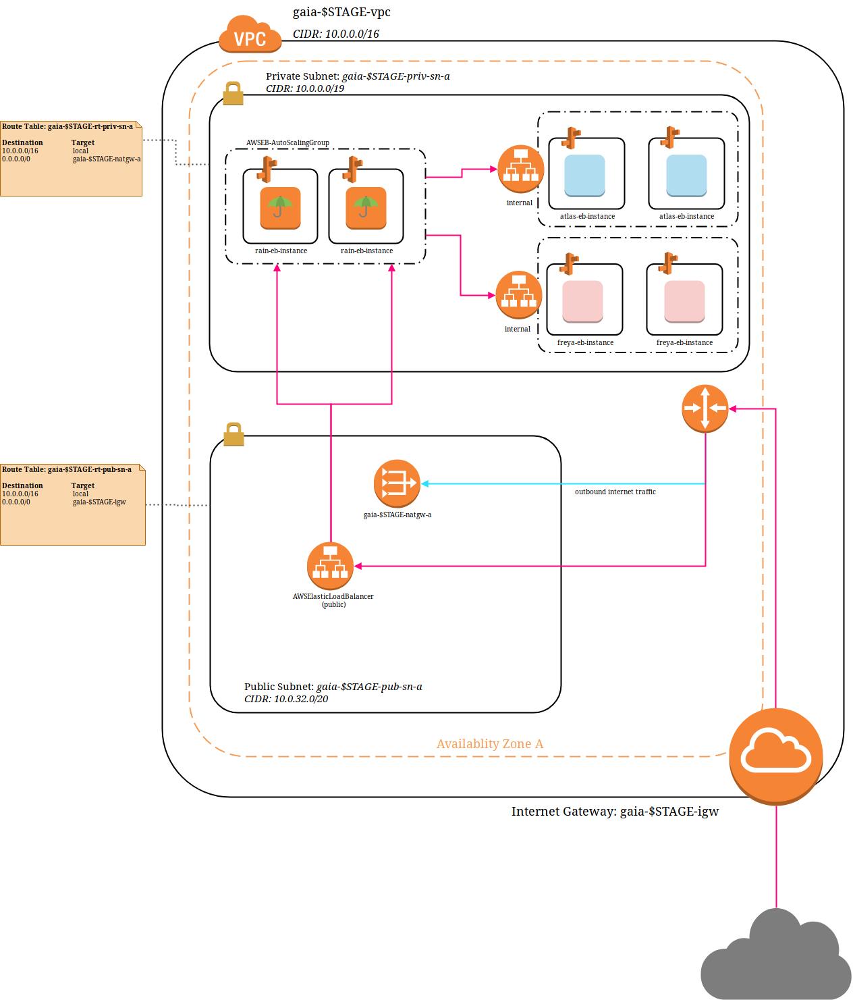
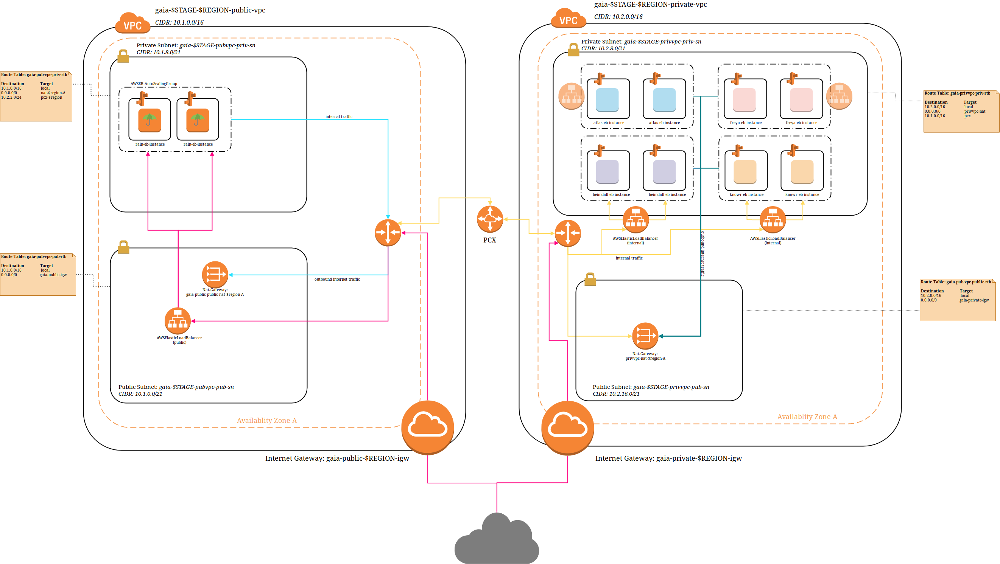

# AWS Architecture Evaluation

This document evaluates the current AWS architecture and offers two alternative architectural approaches considering scalability, architectural overhead, costs and security aspects.

> Costs are caluclated based on subjective assumptions. To include scaling costs one additional EC2 instance with 100% utilization is included in the total costs

The above-remarked points serve as the evaluation basis and each presented architecture (current and draft) will be evaluated considering these aspects.

> Open questions and technical uncertainties are still present so all information is subject to change.

## Current architecture

The current Amazon Web Services (AWS) architecture is solely based on AWS Elastic Beanstalk and the Default Virtual Private Cloud (VPC) created initially by AWS. Eventhough it serves its purpose the solution is far from ideal considering architectural and security aspects.

> Elastic Beanstalk requires the useage of at least two availablity zones!

Most parts of the current architecture are based on Elastic Beanstalk's and general default settings. Eventhough the default settings are convenient and result in a low overhead they contain a set of drawbacks concerning security and scaleability.

One important concern is logical and topological segregation of the services. Currently each service (atlas, freya and rain) is reachable through the internet which opens up attack vectors for a potential threat. Eventhough the traffic is routed through an Elastic Loadbalancer and instances itself are secured via security group rules, attack vectors still exist. For example potential security holes in software we use (e.g. Tomcat, Spring etc.) could still compromise the system.

Services such as Atlas should not be directly accessible over the internet since Atlas Request should be funneled through Rain for authentification, billing and metrics.

Moreover staging and live services are not topological separed meaning that every service, business or infrastructural reside within the same VPC and the same subnets which cripples the scaleability of the complete system.

Infrastructural services such as Sonar or Themis consume an Elastic IP Address (EIP) in order to be accessible over the internet. The question remains if such services should be accessible over the public internet (?) or if a VPN solution would be worthwhile.

> The current limit for EIPs are 5 per region. Single Instance Elastic Beanstalk environments consume an EIP.

Anyhow a proper segregation (region, subnet etc.) should be implemented for those services as well.

## Architecture proposal

Due to the simplicity and and the abstractions Elastic Beanstalk provides the following proposals
are based on similiar principles as the original architecture. Meaning a service is equatable to an
Elastic Beanstalk multi docker container environment and thus deployed as such.

### Single VPC architecture

The single VPC architecture is an extension of the current architecture and segregates public and private
services into their own dedicated subnets. Services running in the private subnet are not directly accessbile over the internet but through the usage of a NAT Gateway are still able to communicate with
the outside world.

> A NAT Gateway enables instances in private subnet to connect to the internet or other AWS services, but prevents the internet from initiating a connection with those instances. One NAT Gateway consumes one EIP.

This approach remedies some security concerns and implements a proper segregation between public and
private services. Furthermore the configuration overhead is reasonable.

Complete separation of beta and live systems would require 2 VPCs and is certainly possible in only one region.

#### Projected costs

> Projected costs are just a raw estimation!

| AWS Service                 |    Costs    |
| --------------------------- | :---------: |
| 4 x t2.medium EC2 Instances |   $165.36   |
| 3 x Amazon ELB              |     $60     |
| 1 x NAT Gateway (min)       |   $38.13    |
| **Total per system**        | **$263.49** |

### Dual VPC architecture

In the dual architecture public and private services reside in their own respectible VPCs which are connected through a PCX. On one hand further increases security but on the other hand comes with a larger configuration and complexity overhead.

Considering only five VPCs are allowed per region a complete separation of beta and live systems would
already consume four VPCs. Furthermore atleast two NAT Gateways (per availablity zone) are required which consume at least two EIPs.

This means a complete separation of beta and live within the same region is **not** possible if each stage should get its own VPC.

#### Projected costs

> Projected costs are just a raw estimation!

| AWS Service                 |    Costs    |
| --------------------------- | :---------: |
| 4 x t2.medium EC2 Instances |   $165.36   |
| 3 x Amazon ELB              |     $60     |
| 2 x NAT Gateway (min)       |   $76.26    |
| **Total per system**        | **$279.75** |

## Conclusion

Both the single as the dual VPC architecture would be a significant upgrade compared to the default-heavy current architecture. The usage of customized VPC and customized subnet layouts allow for flexible and extendable cloud network designs. 

The question of staging separation still remains though: __Should beta and live live in the same VPC?__
If this should be the case then beta and live would share certain AWS resources such as NAT Gateways and compete for resources.  Atleast stages should be separated by subnets. Meaning that each stage has its own public/private subnet for its instances.

Instructrual Services such as Themis and Sonar should be put in its own region and **should not**  be in the same VPC as our production instances. 

### CIDR Distribution

VPC: 10.1.0.0/16
        10.1.0.0/18 - AZ A
            - 10.1.0.0/21 Public
            - 10.1.8.0/20 Private
        10.1.64.0/18 - AZ B
            - 10.1.64.0/21 Public
            - 10.1.8.0/20 Private
        10.1.128.0/18 - AZ C
            - 10.1.0.0/21 Public
            - 10.1.8.0/20 Private

